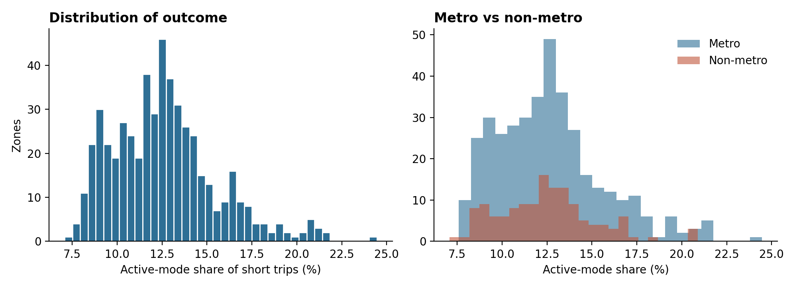
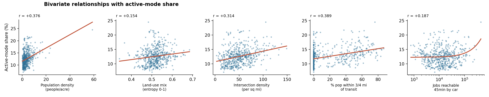
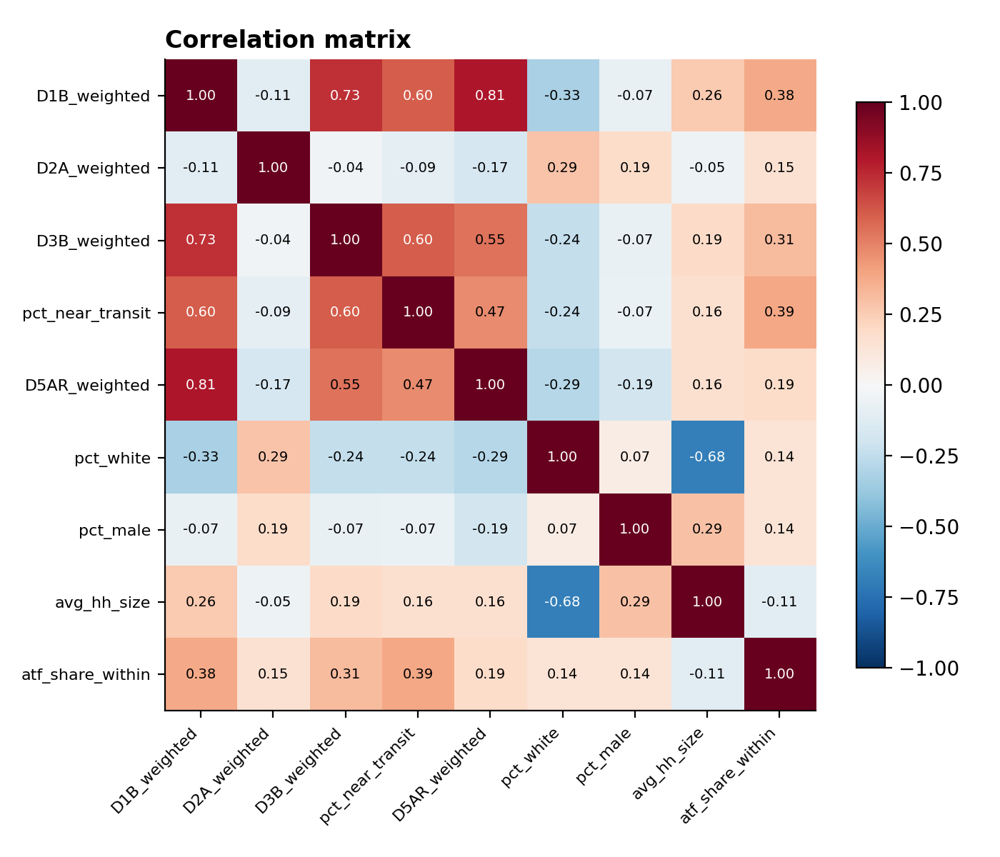
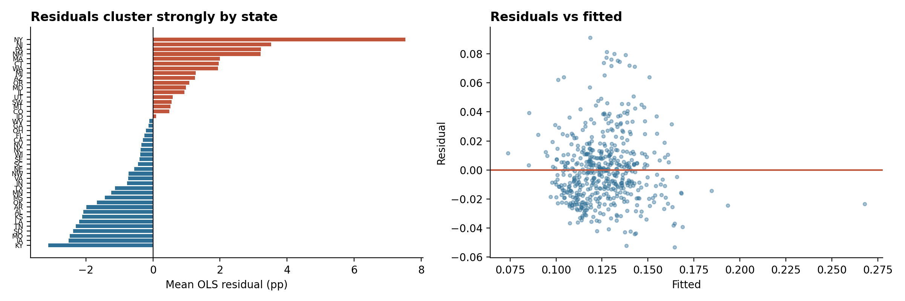
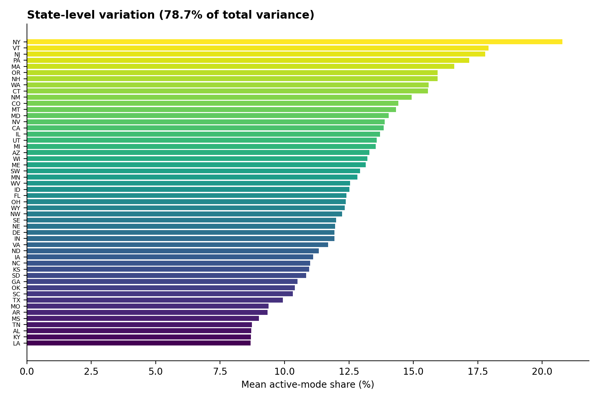
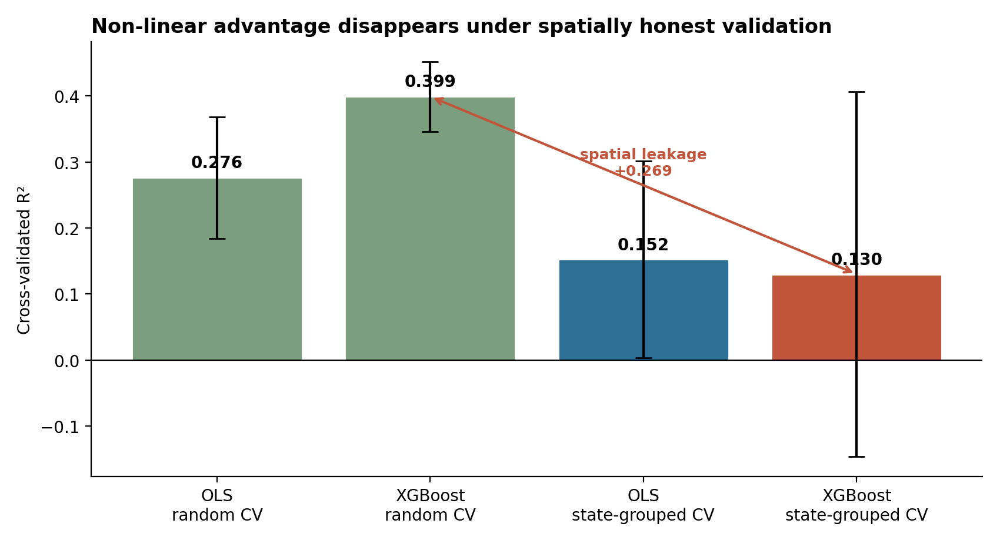
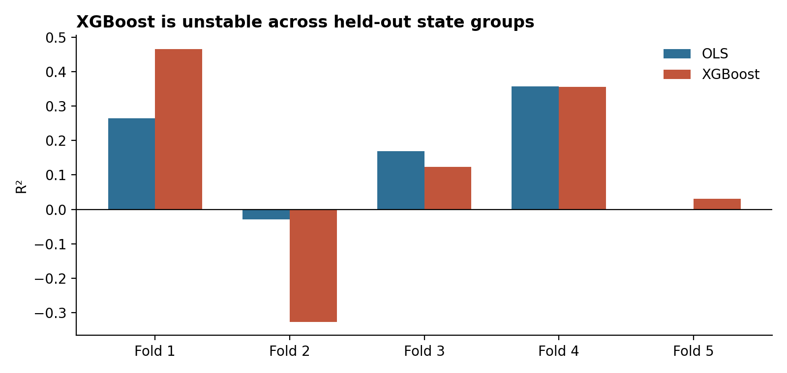
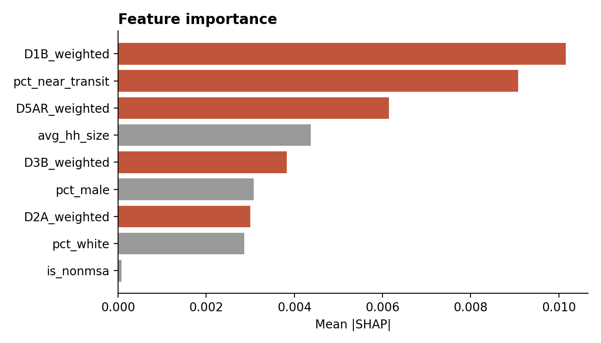
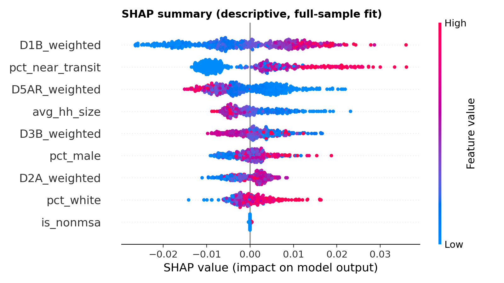
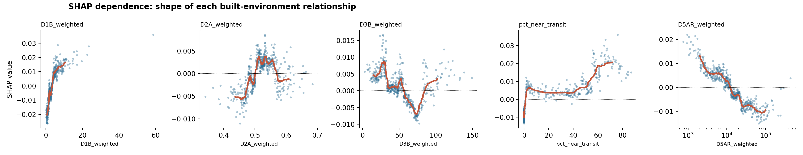

# Findings

---

## 1. The outcome

Active-mode share of short trips averages **12.6%** across 517 zones, ranging from 7.1% to
24.5%.

Metro and non-metro zones are **nearly identical** (12.64% vs 12.43%). This is
counterintuitive — one would expect rural areas to be far more car-dependent. The likely
explanation is that non-metro zones contain small towns where short intra-town trips are
walkable, and that metro zones dilute dense cores with car-oriented suburbs. It also
foreshadows the weakness of `is_nonmsa` as a predictor (mean |SHAP| 0.0001).

---

## 2. Bivariate relationships

| Predictor | r with outcome |
|---|---|
| Population density | **+0.376** |
| % near transit | **+0.389** |
| Intersection density | +0.314 |
| Auto job accessibility | +0.187 |
| Land-use mix | +0.154 |

All point in theoretically expected directions at plausible magnitudes. Note that auto job
accessibility is **positive** bivariately but turns **negative** once density and transit are
controlled — a suppression effect worth flagging (see §4).

---

## 3. Spatial dependence — the central diagnostic

OLS residuals cluster strongly by state: **F = 18.1, p ≈ 1×10⁻⁷⁷, 63.4% of residual variance
between states.**

Predicting each zone from its **state mean alone** yields **R² = 0.787** — far above anything
the built-environment model achieves. Whatever drives active travel at this scale is
overwhelmingly regional.

---

## 4. Linear baseline

In-sample R² = 0.346, adj R² = 0.334.

| Variable | Coefficient | p |
|---|---|---|
| Population density | +4.12e-03 | *** |
| % near transit | +3.14e-04 | *** |
| Auto job accessibility | **−2.04e-07** | *** |
| Land-use mix | +6.36e-02 | * |
| Average household size | −2.73e-02 | *** |
| % male | +3.52e-03 | *** |
| % white | +1.76e-04 | 0.060 |
| `is_nonmsa` | +5.04e-03 | 0.109 |
| **Intersection density** | +3.91e-06 | **0.956** |

Two results stand out.

**Auto job accessibility is negative.** Holding density and transit constant, places where
cars reach many jobs quickly have *less* active travel. Car convenience appears to suppress
active modes — consistent with the induced-demand and accessibility literature.

**Intersection density is entirely non-significant (p = 0.96)**, despite a bivariate
correlation of +0.314. Street connectivity is one of the most established walkability
predictors at neighbourhood scale. Its collapse here is the clearest signal that
metropolitan-scale aggregation is destroying the relevant variation: averaging a gridded
downtown with cul-de-sac suburbs yields a number that describes neither.

> **Caveat.** Given 63.4% between-state residual variance, OLS standard errors are
> understated. These significance levels should be read as indicative, not exact.

---

## 5. Model comparison — the headline result

| Model | Validation | R² | SD |
|---|---|---|---|
| OLS | random 5-fold | 0.276 | 0.092 |
| XGBoost | random 5-fold | **0.399** | 0.053 |
| OLS | **state-grouped** | **0.152** | 0.149 |
| XGBoost | **state-grouped** | 0.130 | 0.277 |

Under random CV, XGBoost beats OLS by **+0.123** — the kind of margin routinely reported as
evidence for non-linearity. Under state-grouped CV the advantage is **−0.022**: it reverses.

**Spatial leakage is +0.269, more than double the apparent non-linear gain.**

### Instability

XGBoost per-fold R² ranges from **+0.456 to −0.324**. On some held-out state groups it is
worse than predicting the mean. OLS is more stable (−0.029 to +0.357) though also weak.

### Not a tuning artefact

| Variant | Grouped CV R² |
|---|---|
| depth 3 (primary) | 0.130 |
| depth 2 | 0.148 |
| depth 2 + L2 regularisation | 0.144 |
| decision stumps (depth 1) | 0.136 |
| **OLS** | **0.152** |

Every simplification improves XGBoost slightly, and none reaches OLS. The pattern — simpler
is better, but still not competitive — indicates the flexible model is fitting
state-specific noise it cannot carry to unseen states.

---

## 6. SHAP (descriptive)

Computed on a full-sample fit. **Descriptive of fitted relationships, not validated
thresholds** — the model does not generalize across states.

| Feature | Mean \|SHAP\| |
|---|---|
| Population density | 0.0102 |
| % near transit | 0.0091 |
| Auto job accessibility | 0.0062 |
| Average household size | 0.0044 |
| Intersection density | 0.0038 |
| `is_nonmsa` | 0.0001 |

Quintile-averaged SHAP values:

| Predictor | Q1 → Q5 | Shape |
|---|---|---|
| Population density | −0.018 → +0.014 | monotone increasing, near-linear |
| % near transit | −0.007 → +0.015 | flat then sharp gain in top tier |
| Auto job accessibility | +0.009 → −0.009 | monotone decreasing |
| Land-use mix | −0.004 → +0.000 | rises to Q3 then flattens |
| Intersection density | +0.006 → −0.001 | flat to slightly negative |

Transit access is the one variable showing a plausible threshold: little effect until a
substantial share of population is within 3/4 mile, then a sharp rise. Given the model's
poor out-of-state generalisation, this should be treated as a hypothesis for
finer-resolution testing, not a finding.

---

## 7. Interpretation

At national zone-level resolution, built-environment effects on active-mode share are
**modest and adequately captured by a linear specification**.

The most likely explanation is **spatial aggregation**. FHWA zones are metropolitan-scale;
population weighting mitigates but cannot eliminate the averaging of internally
heterogeneous areas. The collapse of intersection density — a robust neighbourhood-scale
predictor — to complete non-significance is the sharpest evidence for this reading, and the
78.7% state-level variance share is consistent with it.

**This does not refute the non-linear built-environment literature. It bounds it.** Those
effects appear to operate at neighbourhood scale and may not survive aggregation to
metropolitan units.

It also raises a methodological concern worth taking seriously: studies validating
non-linear BE models with random cross-validation on spatially autocorrelated data may be
reporting performance that would not survive spatial validation. The +0.269 leakage measured
here is large enough to account for a reported non-linear advantage on its own.

---

## 8. What would change the answer

1. **Finer spatial resolution** — tract or block-group level within selected metros. The
   direct test of the aggregation hypothesis.
2. **Explicit spatial models** — spatial lag/error or GWR, given 63.4% between-state residual
   variance.
3. **Measuring the regional effect** — identifying what "state" stands for (climate, DOT
   investment, development era) and including it directly.
